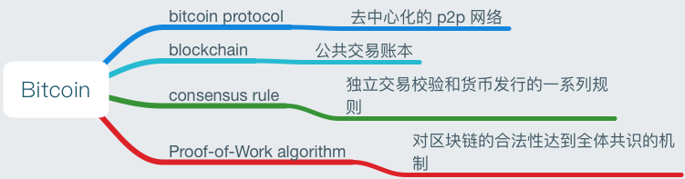

# 比特币简介

## 什么是比特币?

比特币是一个基于数字货币生态系统而形成的概念与技术的集合。

比特币用户拥有能够使他们在比特币网络中证明自己交易权的密钥，解密后可使用比特币，也可以将它购买、出售，以及与其他币种进行兑换。

用传统货币能做到的事情，用户在网络上利用比特币都可以做到，包括发送给新的接收者。这些密钥通常存储在每个用户的计算机的**数字钱包**里。**每一笔交易都需用密钥解密**，这是使用比特币的唯一先决条件，它完完全全掌握在每个用户的手中。

比特币是一个分布式的点对点网络系统。因此，没有“中央”服务器，也没有中央控制点。比特币是通过一个名为“挖矿(mining)”的过程产生的，挖矿需要在处理比特币交易的同时参与竞赛来解决一个数学问题。

比特币协议包括了内置算法，该算法可以调节网络中的挖矿功能。

新比特币开采出的每四年，这项协议也会减半开采速率，并限制比特币的开采总量为一个固定值:2,100 万枚。

比特币还可以表示一种网络传输协议，一种 P2P 网络，一种分布式计算创新。比特币只是这种发明的第一个应用。 比特币代表了密码学和分布式系统研究的顶峰，包括以下四个关键的创新点：

- 分布式的 P2P 网络（比特币协议）
- 公开的大账本（比特链）
- 一系列的规则用来独立审核交易和发行货币（共识机制）
- 对于正确区块链的全局去中心化的共识机制（工作量算法）

### 比特币之前的数字货币

切实可行的数字货币的出现是与密码学发展息息相关的。

任何接受数字货币的人都面临的三个基本问题是: 

1. 我能相信这钱是真实可信的，而不是伪造的吗? 
2. 我能确定这笔钱只能支付一次吗?(又名“双重支付”问题)
3. 我能确定没人声称这笔钱属于他而不属于我吗？

密码学可以解决这些问题。

20世纪80年代后期，随着密码学的流行，研究人员开始使用密码学构建数字货币。早期的数字货币通常由国家货币或贵金属（如黄金等）背书。

尽管早期数字货币可以运行，但他们是中心化的，易于遭受政府和黑客的攻击。因此一个健壮的数字货币需要去中心化，以避免单点攻击。

## 发展史

2008年，中本聪发表一篇论文[《Bitcoin: A Peer-to-Peer Electronic Cash System》](https://bitcoin.org/bitcoin.pdf)，从此比特币诞生。中本聪利用已有的发明，比如 `b-money`, `HashCash` 等，创造出一种完全去中心化的数字货币。核心的创新点在于使用一种分布式计算系统（称为“工作量证明”算法），每10分钟全球“选举”一次，允许分散的网络达成共识，从而避免“双重支付”问题。

比特币网络 2009 开始运行。

中本聪从 2011 年 4 月从公众视野中消失。

### 分布式计算的解决方案

中本聪的发明同时也是一种实用创新的解决方案，用来解决分布式计算的问题，即“拜占庭将军”问题。

## 应用、用户和故事

比特币是钱的创新。钱的核心就是方便用户的价值交换。以下是一些用户故事：

### 北美的低价零售

Alice 居住在北加利福尼亚的湾区。她从技术达人朋友那里听说了比特币，想使用它。我们将跟随她来了解比特币，获取，花费比特币购买一杯咖啡。这个故事将以零售消费者的视角，向我们介绍软件，交换和基本的交易等内容。

### 北美的高端零售

Carol 是旧金山的一维艺术画廊老板。她以比特币售卖昂贵的画作。这个故事将介绍对于高端物品交易中涉及的“51%”共识攻击。

### 离岸合同服务

Bob，一位帕洛阿尔托的咖啡厅老板，想建立一个新网站。他和印度班加罗尔的一位网络开发人员 Gopesh 签订了合同。Gepesh 同意酬劳用比特币支付。这个故事会介绍比特币在外包，合同服务和国际电汇中的用法。

### 网店

Gabriel 是里约热内卢一位有事业心的少年，经营一家小型网店，售卖印有比特币的T恤，咖啡杯和贴画。Gabriel 太小，没有自己的银行卡账户，但他的父母鼓励他的创业精神。

### 慈善捐赠

### 进出口

### 挖矿

## 入门

比特币是一种协议，可以使用专用客户端来交流。“比特币钱包”是最常用的比特币系统用户接口，就像浏览器是 HTTP 协议最常用的用户接口。

根据平台不同，比特币钱包可以分为以下几种：

- 桌面钱包：不安全
- 移动端钱包
- 网页钱包：不建议存储大量比特币
- 硬件钱包
- 纸钱包

还可以根据钱包的自治程度和与比特币网络的交互来分类：

- 全节点客户端
- 轻量客户端：也称为 simple-payment-verification (SPV) 客户端。
- 第三方 API 客户端

## References
- [Introduction - bitcoinbook](https://github.com/bitcoinbook/bitcoinbook/blob/second_edition/ch01.asciidoc)